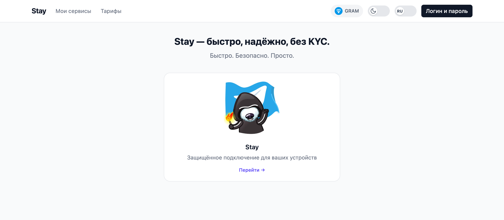
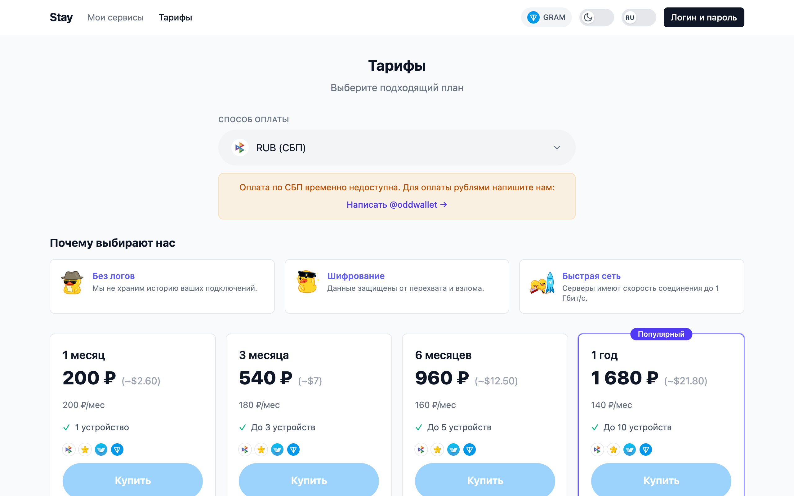
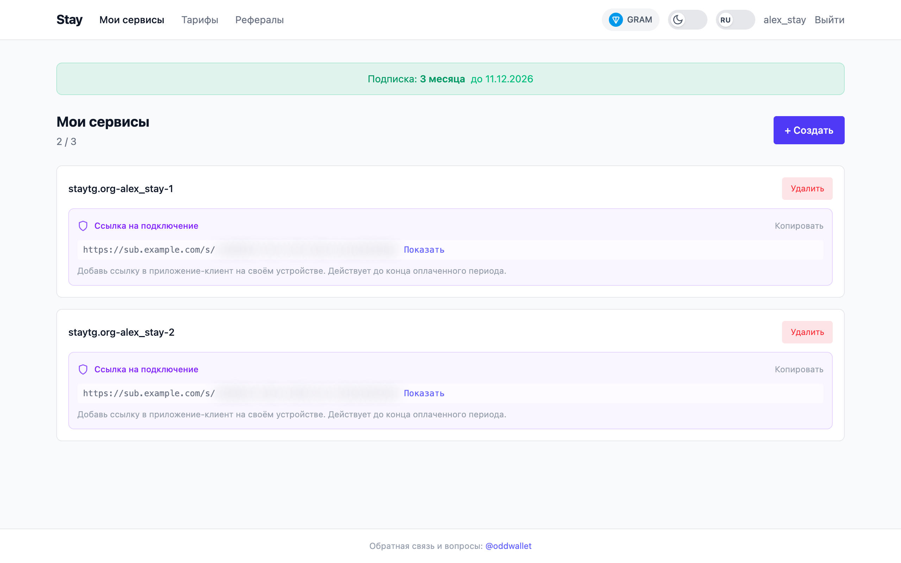
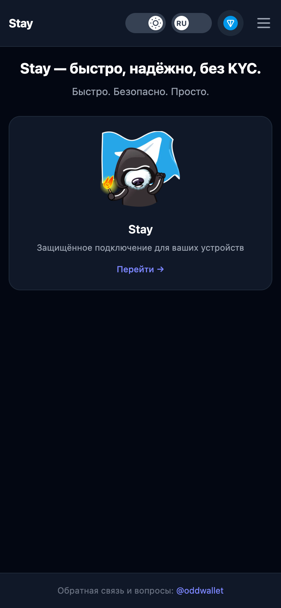
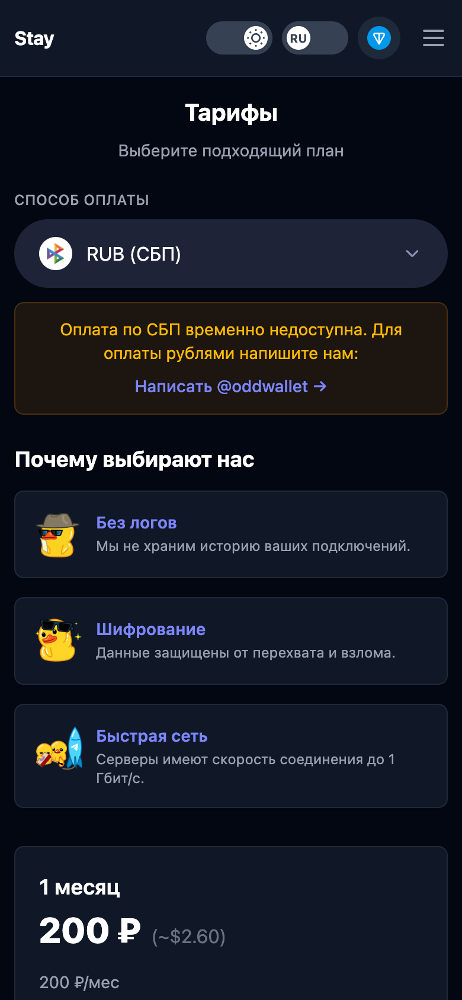
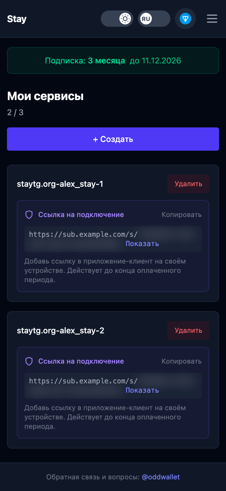
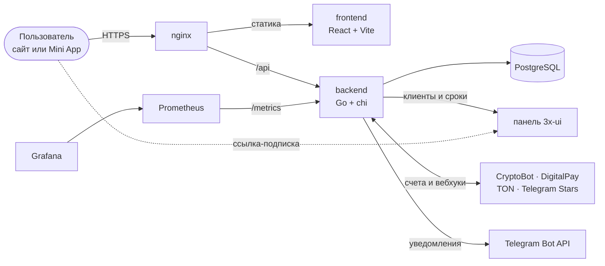
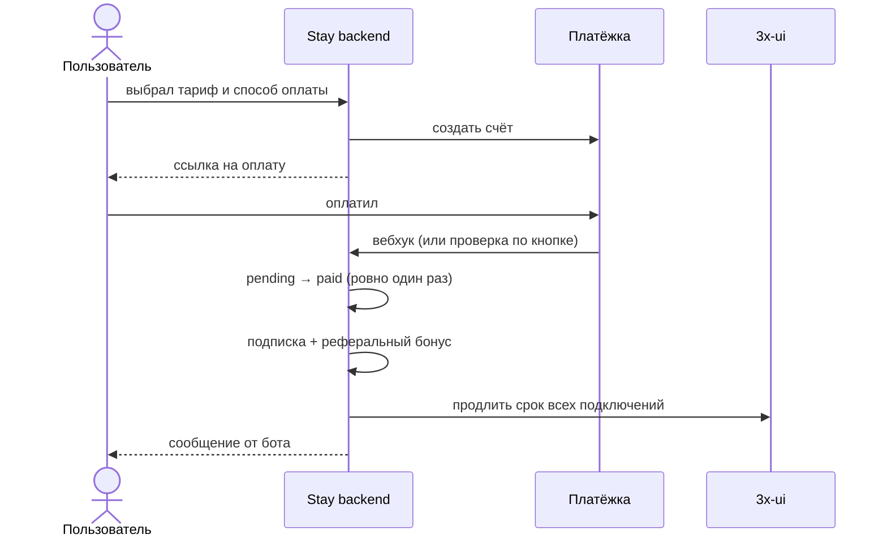

<div align="center">

# Stay

**Telegram Mini App и сайт для продажи подписок на защищённое подключение.**
Оплата в пару кликов, ссылка на подключение выдаётся сразу и работает ровно до конца оплаченного периода.

[](backend/go.mod)
[](frontend/package.json)
[](frontend/package.json)
[](backend/internal/database/db.go)
[](https://core.telegram.org/bots/webapps)
[](ops/README.md)

[Возможности](#возможности) · [Скриншоты](#скриншоты) · [Как устроено](#как-устроено) · [Запуск](#запуск) · [Эксплуатация](ops/README.md)

</div>

<p align="center">
  <picture>
    <source media="(prefers-color-scheme: dark)" srcset="docs/screenshots/home-dark.png">
    
  </picture>
</p>

## Возможности

| | |
|---|---|
| 💳 **Четыре способа оплаты** | CryptoBot, СБП (DigitalPay), TON через TON Connect, Telegram Stars |
| ⏳ **Подписки 1 / 3 / 6 / 12 месяцев** | Продление добавляет срок к текущему, а не сгорает |
| 🔗 **Ссылки-подписки** | Клиенты создаются в панели 3x-ui, ссылка перестаёт работать в день окончания подписки |
| 📱 **Telegram Mini App** | Вход по `initData`, оплата звёздами прямо в Telegram, уведомления от бота |
| 🔐 **Три способа входа** | Telegram OIDC, Mini App, логин и пароль |
| 🎁 **Рефералы** | Пригласивший получает 15% дней от каждой оплаты друга |
| 🛠 **Админка** | Пользователи, роли, лимиты устройств, все подключения |
| 📊 **Мониторинг и бэкапы** | Метрики Prometheus, дашборд Grafana, дамп базы раз в две недели |

## Скриншоты

<table>
  <tr>
    <td width="50%">
      <picture>
        <source media="(prefers-color-scheme: dark)" srcset="docs/screenshots/pricing-dark.png">
        
      </picture>
      <p align="center"><b>Тарифы и способы оплаты</b></p>
    </td>
    <td width="50%">
      <picture>
        <source media="(prefers-color-scheme: dark)" srcset="docs/screenshots/services-dark.png">
        
      </picture>
      <p align="center"><b>Подписка и ссылки на подключение</b></p>
    </td>
  </tr>
</table>

<details>
<summary><b>📱 Как это выглядит в Telegram</b></summary>
<br>
<p align="center">
  
  &nbsp;
  
  &nbsp;
  
</p>
</details>

## Как устроено



<details>
<summary><b>Путь оплаты</b></summary>
<br>


</details>

<details>
<summary><b>Структура репозитория</b></summary>
<br>

```
backend/          Go API
  cmd/server/       точка входа, роутинг
  internal/
    handlers/       HTTP: авторизация, оплаты, подключения, админка, бот
    database/       Postgres, миграции при старте
    xui/            клиент API 3x-ui v3
frontend/         React SPA (Vite, Tailwind, TON Connect)
ops/
  monitoring/       Prometheus, Grafana, экспортеры (docker compose)
  backup/           pg_dump раз в две недели + systemd timer
deploy/           инструкция по деплою на хост
docs/screenshots/ картинки для этого README
```
</details>

## Запуск

```bash
# бэкенд: нужен PostgreSQL и .env (переменные в deploy/README.md);
# 8080 — порт, на который dev-сервер фронта проксирует /api
cd backend && SERVER_PORT=8080 go run ./cmd/server

# фронт: http://localhost:5173
cd frontend && npm ci && npm run dev
```

Тесты:

```bash
cd backend && go test ./...
```

Тест базы запускается только с переменной `TEST_DATABASE_URL`, указывающей на одноразовый Postgres: он пересоздаёт схему.

Продакшн-деплой описан в [deploy/README.md](deploy/README.md), мониторинг и бэкапы в [ops/README.md](ops/README.md).
